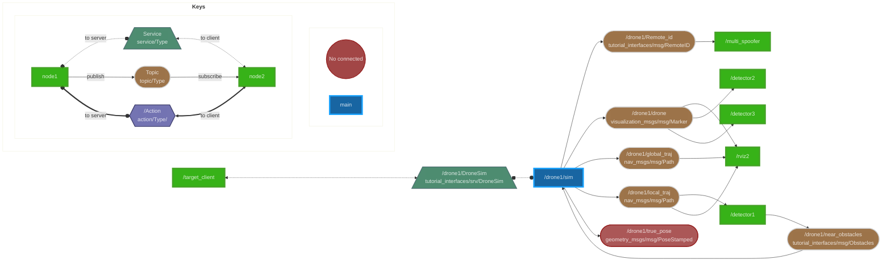

```mermaid
flowchart LR

/drone1/sim[ /drone1/sim ]:::main
/detector1[ /detector1 ]:::node
/multi_spoofer[ /multi_spoofer ]:::node
/rviz2[ /rviz2 ]:::node
/detector2[ /detector2 ]:::node
/detector3[ /detector3 ]:::node
/target_client[ /target_client ]:::node
/drone1/near_obstacles([ /drone1/near_obstacles<br>tutorial_interfaces/msg/Obstacles ]):::topic
/drone1/Remote_id([ /drone1/Remote_id<br>tutorial_interfaces/msg/RemoteID ]):::topic
/drone1/drone([ /drone1/drone<br>visualization_msgs/msg/Marker ]):::topic
/drone1/global_traj([ /drone1/global_traj<br>nav_msgs/msg/Path ]):::topic
/drone1/local_traj([ /drone1/local_traj<br>nav_msgs/msg/Path ]):::topic
/drone1/true_pose([ /drone1/true_pose<br>geometry_msgs/msg/PoseStamped ]):::bugged
/drone1/DroneSim[/ /drone1/DroneSim<br>tutorial_interfaces/srv/DroneSim \]:::service

/drone1/near_obstacles --> /drone1/sim
/drone1/local_traj --> /detector1
/drone1/Remote_id --> /multi_spoofer
/drone1/drone --> /rviz2
/drone1/global_traj --> /rviz2
/drone1/local_traj --> /rviz2
/drone1/drone --> /detector2
/drone1/drone --> /detector3
/drone1/sim --> /drone1/Remote_id
/drone1/sim --> /drone1/drone
/drone1/sim --> /drone1/global_traj
/drone1/sim --> /drone1/local_traj
/drone1/sim --> /drone1/true_pose
/detector1 --> /drone1/near_obstacles
/drone1/DroneSim o-.-o /drone1/sim
/target_client <-.-> /drone1/DroneSim


subgraph keys[<b>Keys<b/>]
subgraph nodes[<b><b/>]
topicb((No connected)):::bugged
main_node[main]:::main
end
subgraph connection[<b><b/>]
node1[node1]:::node
node2[node2]:::node
node1 o-.-o|to server| service[/Service<br>service/Type\]:::service
service <-.->|to client| node2
node1 -->|publish| topic([Topic<br>topic/Type]):::topic
topic -->|subscribe| node2
node1 o==o|to server| action{{/Action<br>action/Type/}}:::action
action <==>|to client| node2
end
end
classDef node opacity:0.9,fill:#2A0,stroke:#391,stroke-width:4px,color:#fff
classDef action opacity:0.9,fill:#66A,stroke:#225,stroke-width:2px,color:#fff
classDef service opacity:0.9,fill:#3B8062,stroke:#3B6062,stroke-width:2px,color:#fff
classDef topic opacity:0.9,fill:#852,stroke:#CCC,stroke-width:2px,color:#fff
classDef main opacity:0.9,fill:#059,stroke:#09F,stroke-width:4px,color:#fff
classDef bugged opacity:0.9,fill:#933,stroke:#800,stroke-width:2px,color:#fff
style keys opacity:0.15,fill:#FFF
style nodes opacity:0.15,fill:#FFF
style connection opacity:0.15,fill:#FFF

```

```mermaid
flowchart LR

/drone1/sim[ /drone1/sim ]:::main
/detector1[ /detector1 ]:::main
/detector2[ /detector2 ]:::main
/detector3[ /detector3 ]:::main
/detector1[ /detector1 ]:::node
/multi_spoofer[ /multi_spoofer ]:::node
/rviz2[ /rviz2 ]:::node
/detector2[ /detector2 ]:::node
/detector3[ /detector3 ]:::node
/target_client[ /target_client ]:::node
/drone2/sim[ /drone2/sim ]:::node
/drone3/sim[ /drone3/sim ]:::node
/drone1/near_obstacles([ /drone1/near_obstacles<br>tutorial_interfaces/msg/Obstacles ]):::topic
/drone1/Remote_id([ /drone1/Remote_id<br>tutorial_interfaces/msg/RemoteID ]):::topic
/drone1/drone([ /drone1/drone<br>visualization_msgs/msg/Marker ]):::topic
/drone1/global_traj([ /drone1/global_traj<br>nav_msgs/msg/Path ]):::topic
/drone1/local_traj([ /drone1/local_traj<br>nav_msgs/msg/Path ]):::topic
/drone1/true_pose([ /drone1/true_pose<br>geometry_msgs/msg/PoseStamped ]):::bugged
/drone2/drone([ /drone2/drone<br>visualization_msgs/msg/Marker ]):::topic
/drone3/drone([ /drone3/drone<br>visualization_msgs/msg/Marker ]):::topic
/drone2/local_traj([ /drone2/local_traj<br>nav_msgs/msg/Path ]):::topic
/drone2/near_obstacles([ /drone2/near_obstacles<br>tutorial_interfaces/msg/Obstacles ]):::topic
/drone3/local_traj([ /drone3/local_traj<br>nav_msgs/msg/Path ]):::topic
/drone3/near_obstacles([ /drone3/near_obstacles<br>tutorial_interfaces/msg/Obstacles ]):::topic
/drone1/DroneSim[/ /drone1/DroneSim<br>tutorial_interfaces/srv/DroneSim \]:::service

/drone1/near_obstacles --> /drone1/sim
/drone1/local_traj --> /detector1
/drone2/drone --> /detector1
/drone3/drone --> /detector1
/drone1/drone --> /detector2
/drone2/local_traj --> /detector2
/drone3/drone --> /detector2
/drone1/drone --> /detector3
/drone2/drone --> /detector3
/drone3/local_traj --> /detector3
/drone1/local_traj --> /detector1
/drone1/Remote_id --> /multi_spoofer
/drone1/drone --> /rviz2
/drone1/global_traj --> /rviz2
/drone1/local_traj --> /rviz2
/drone1/drone --> /detector2
/drone1/drone --> /detector3
/drone2/near_obstacles --> /drone2/sim
/drone3/near_obstacles --> /drone3/sim
/drone1/sim --> /drone1/Remote_id
/drone1/sim --> /drone1/drone
/drone1/sim --> /drone1/global_traj
/drone1/sim --> /drone1/local_traj
/drone1/sim --> /drone1/true_pose
/detector1 --> /drone1/near_obstacles
/detector2 --> /drone2/near_obstacles
/detector3 --> /drone3/near_obstacles
/detector1 --> /drone1/near_obstacles
/multi_spoofer --> /drone2/drone
/multi_spoofer --> /drone3/drone
/multi_spoofer --> /drone2/local_traj
/multi_spoofer --> /drone3/local_traj
/drone1/DroneSim o-.-o /drone1/sim
/target_client <-.-> /drone1/DroneSim


subgraph keys[<b>Keys<b/>]
subgraph nodes[<b><b/>]
topicb((No connected)):::bugged
main_node[main]:::main
end
subgraph connection[<b><b/>]
node1[node1]:::node
node2[node2]:::node
node1 o-.-o|to server| service[/Service<br>service/Type\]:::service
service <-.->|to client| node2
node1 -->|publish| topic([Topic<br>topic/Type]):::topic
topic -->|subscribe| node2
node1 o==o|to server| action{{/Action<br>action/Type/}}:::action
action <==>|to client| node2
end
end
classDef node opacity:0.9,fill:#2A0,stroke:#391,stroke-width:4px,color:#fff
classDef action opacity:0.9,fill:#66A,stroke:#225,stroke-width:2px,color:#fff
classDef service opacity:0.9,fill:#3B8062,stroke:#3B6062,stroke-width:2px,color:#fff
classDef topic opacity:0.9,fill:#852,stroke:#CCC,stroke-width:2px,color:#fff
classDef main opacity:0.9,fill:#059,stroke:#09F,stroke-width:4px,color:#fff
classDef bugged opacity:0.9,fill:#933,stroke:#800,stroke-width:2px,color:#fff
style keys opacity:0.15,fill:#FFF
style nodes opacity:0.15,fill:#FFF
style connection opacity:0.15,fill:#FFF

```

```mermaid
flowchart LR

/drone1/sim[ /drone1/sim ]:::main
/detector1[ /detector1 ]:::main
/detector2[ /detector2 ]:::main
/detector3[ /detector3 ]:::main
/target_client[ /target_client ]:::main
/detector1[ /detector1 ]:::node
/multi_spoofer[ /multi_spoofer ]:::node
/rviz2[ /rviz2 ]:::node
/detector2[ /detector2 ]:::node
/detector3[ /detector3 ]:::node
/target_client[ /target_client ]:::node
/drone2/sim[ /drone2/sim ]:::node
/drone3/sim[ /drone3/sim ]:::node
/drone1/near_obstacles([ /drone1/near_obstacles<br>tutorial_interfaces/msg/Obstacles ]):::topic
/drone1/Remote_id([ /drone1/Remote_id<br>tutorial_interfaces/msg/RemoteID ]):::topic
/drone1/drone([ /drone1/drone<br>visualization_msgs/msg/Marker ]):::topic
/drone1/global_traj([ /drone1/global_traj<br>nav_msgs/msg/Path ]):::topic
/drone1/local_traj([ /drone1/local_traj<br>nav_msgs/msg/Path ]):::topic
/drone1/true_pose([ /drone1/true_pose<br>geometry_msgs/msg/PoseStamped ]):::bugged
/drone2/drone([ /drone2/drone<br>visualization_msgs/msg/Marker ]):::topic
/drone3/drone([ /drone3/drone<br>visualization_msgs/msg/Marker ]):::topic
/drone2/local_traj([ /drone2/local_traj<br>nav_msgs/msg/Path ]):::topic
/drone2/near_obstacles([ /drone2/near_obstacles<br>tutorial_interfaces/msg/Obstacles ]):::topic
/drone3/local_traj([ /drone3/local_traj<br>nav_msgs/msg/Path ]):::topic
/drone3/near_obstacles([ /drone3/near_obstacles<br>tutorial_interfaces/msg/Obstacles ]):::topic
/drone1/DroneSim[/ /drone1/DroneSim<br>tutorial_interfaces/srv/DroneSim \]:::service

/drone1/near_obstacles --> /drone1/sim
/drone1/local_traj --> /detector1
/drone2/drone --> /detector1
/drone3/drone --> /detector1
/drone1/drone --> /detector2
/drone2/local_traj --> /detector2
/drone3/drone --> /detector2
/drone1/drone --> /detector3
/drone2/drone --> /detector3
/drone3/local_traj --> /detector3
/drone1/local_traj --> /detector1
/drone1/Remote_id --> /multi_spoofer
/drone1/drone --> /rviz2
/drone1/global_traj --> /rviz2
/drone1/local_traj --> /rviz2
/drone1/drone --> /detector2
/drone1/drone --> /detector3
/drone2/near_obstacles --> /drone2/sim
/drone3/near_obstacles --> /drone3/sim
/drone1/sim --> /drone1/Remote_id
/drone1/sim --> /drone1/drone
/drone1/sim --> /drone1/global_traj
/drone1/sim --> /drone1/local_traj
/drone1/sim --> /drone1/true_pose
/detector1 --> /drone1/near_obstacles
/detector2 --> /drone2/near_obstacles
/detector3 --> /drone3/near_obstacles
/detector1 --> /drone1/near_obstacles
/multi_spoofer --> /drone2/drone
/multi_spoofer --> /drone3/drone
/multi_spoofer --> /drone2/local_traj
/multi_spoofer --> /drone3/local_traj
/drone1/DroneSim o-.-o /drone1/sim
/target_client <-.-> /drone1/DroneSim
/target_client <-.-> /drone1/DroneSim


subgraph keys[<b>Keys<b/>]
subgraph nodes[<b><b/>]
topicb((No connected)):::bugged
main_node[main]:::main
end
subgraph connection[<b><b/>]
node1[node1]:::node
node2[node2]:::node
node1 o-.-o|to server| service[/Service<br>service/Type\]:::service
service <-.->|to client| node2
node1 -->|publish| topic([Topic<br>topic/Type]):::topic
topic -->|subscribe| node2
node1 o==o|to server| action{{/Action<br>action/Type/}}:::action
action <==>|to client| node2
end
end
classDef node opacity:0.9,fill:#2A0,stroke:#391,stroke-width:4px,color:#fff
classDef action opacity:0.9,fill:#66A,stroke:#225,stroke-width:2px,color:#fff
classDef service opacity:0.9,fill:#3B8062,stroke:#3B6062,stroke-width:2px,color:#fff
classDef topic opacity:0.9,fill:#852,stroke:#CCC,stroke-width:2px,color:#fff
classDef main opacity:0.9,fill:#059,stroke:#09F,stroke-width:4px,color:#fff
classDef bugged opacity:0.9,fill:#933,stroke:#800,stroke-width:2px,color:#fff
style keys opacity:0.15,fill:#FFF
style nodes opacity:0.15,fill:#FFF
style connection opacity:0.15,fill:#FFF

```
